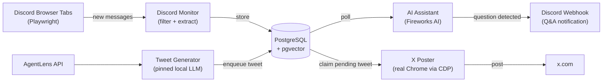

# semi-autopilot

A browser-automation tool that monitors multiple Discord channels simultaneously and uses AI to detect questions and generate answers — **no Bot Token required**.


## Overview

This project has four independently running modules:

- **Discord Monitor** — opens one browser tab per Discord channel using Playwright, injects a `MutationObserver` script to capture new messages in real time, filters noise, and stores everything in PostgreSQL.
- **AI Assistant** — polls the database for unprocessed messages, calls the Fireworks AI API to detect whether each message is a question (≥70% confidence threshold), retrieves relevant context from message history, generates an answer, and pushes both to a Discord channel via Webhook.
- **Tweet Generator** — pulls AI-industry dispatches from the AgentLens public API, writes each one up through a pinned local LLM, renders a card image, and enqueues the result for the X Poster to drain.
- **X Poster** — drains a queue of pending tweets from the database and posts each one through a real Chrome browser driven over CDP, pacing the interaction so it reads as human.

## Architecture



## Features

- Monitors multiple Discord channels in parallel browser tabs
- No Bot Token needed — works via browser automation and DOM observation
- Smart message filtering: drops short messages, trivial phrases, emoji-only, and bot messages
- AI question detection with configurable confidence threshold (default 70%)
- Automatic answer generation with context retrieval from recent message history
- pgvector column on messages table, ready for semantic search
- Queue-driven X posting through a real Chrome, with human-like pacing, a dry-run mode, and a circuit breaker that stops on an expired session rather than hammering the account
- Tweets written from AgentLens dispatches by a pinned local LLM, gated by a deterministic validator (character budget, two tiers of banned phrase, and a whitelist that rejects any number not present in the source material)
- Four post shapes with two card designs, mixed so the timeline does not read as a content farm — half the posts carry no image at all
- Card images rendered from HTML in a throwaway headless Chromium, with embedded fonts so a container and a laptop produce the same pixels

## Quick Start

**Prerequisites:** Node.js 18+, pnpm, Bun, Docker

```bash
# 1. Clone
git clone https://github.com/your-username/semi-autopilot.git
cd semi-autopilot

# 2. Configure environment variables
#    The root .env holds DB_PASSWORD alone. Docker reads it when creating the
#    container and the migrator reads it when connecting, so one value governs
#    both and they cannot drift apart.
cp .env.example .env
cp discord-monitor/.env.example discord-monitor/.env
cp ai-assistant/.env.example ai-assistant/.env
# Edit the .env files with your values (see Configuration below)

# 3. Install dependencies (pnpm workspace, run from the repo root)
pnpm install

# 4. Start PostgreSQL and apply migrations
pnpm db:up

# 5. Start the Discord monitor (keeps running, one tab per channel)
pnpm --filter discord-monitor start

# 6. In a new terminal, start the AI assistant
pnpm --filter ai-assistant start

# 7. In a third terminal, start the X poster.
#    First run only: it opens a Chrome window with a blank dedicated profile.
#    Log in to X manually there — the profile persists.
#    X_DRY_RUN defaults to true, so it runs the full script without posting.
cp x-poster/.env.example x-poster/.env
pnpm --filter x-poster start

# 8. In a fourth terminal, start the tweet generator.
#    LLM_MODEL is required and must name one model — "auto" is rejected.
cp tweet-generator/.env.example tweet-generator/.env
pnpm --filter tweet-generator start
```

### Database commands

The schema lives in `shared/src/schema.ts` and is applied through migrations in
`db/migrations/`. No service creates tables at startup.

| Command | What it does |
|---|---|
| `pnpm db:up` | Start the container, wait until healthy, apply migrations |
| `pnpm db:migrate` | Apply pending migrations only |
| `pnpm db:generate` | Generate a migration after editing `schema.ts` |
| `pnpm db:studio` | Browse the data in a local GUI |
| `pnpm db:reset` | Destroy the volume and rebuild from empty — **deletes all data** |
| `pnpm db:down` | Stop the container, keeping the data |

`DB_PASSWORD` is written into the volume the first time the container is
created. Changing it afterwards has no effect until `pnpm db:reset`.

The tweet generator needs a local OpenAI-compatible endpoint. With OmniRoute:

- **Pin `LLM_MODEL` to one model.** `auto` is rejected by the config loader — it
  falls back across four provider tiers, so the same prompt is served by a
  frontier model one day and a free tier-4 model the next, and these posts go
  out unattended.
- **Disable prompt compression (RTK / Caveman) on this route.** The prompts
  carry a banned-phrase list and a hard character budget: material whose exact
  wording is the point.

The Discord monitor will open a Chromium window. Log in to Discord manually on the first run — Playwright saves the session to `discord-session.json` so you only need to do this once.

## Configuration

### Discord Monitor (`discord-monitor/.env`)

| Variable | Description | Default |
|----------|-------------|---------|
| `DISCORD_CHANNELS` | Comma-separated `guild_id/channel_id` pairs to monitor | required |
| `DB_HOST` | PostgreSQL host | `localhost` |
| `DB_PORT` | PostgreSQL port | `5432` |
| `DB_USER` | PostgreSQL user | required |
| `DB_PASSWORD` | PostgreSQL password | required |
| `DB_NAME` | PostgreSQL database name | `semi_autopilot` |
| `STORAGE_STATE_PATH` | Path to Playwright session file | `./discord-session.json` |
| `ENABLE_FILTERING` | Enable message noise filtering | `true` |
| `MIN_MESSAGE_LENGTH` | Minimum character count to store a message | `30` |
| `CUSTOM_TRIVIAL_PHRASES` | Additional comma-separated phrases to filter out | — |
| `DISCORD_WEBHOOK_URL` | Webhook URL for daily health reports | optional |
| `LOG_LEVEL` | Logging level: `info`, `debug`, `warn` | `info` |

### AI Assistant (`ai-assistant/.env`)

| Variable | Description | Default |
|----------|-------------|---------|
| `FIREWORKS_API_KEY` | Fireworks AI API key | required |
| `DISCORD_WEBHOOK_URL` | Webhook URL to post Q&A results | required |
| `POLLING_INTERVAL_MINUTES` | How often to poll for new messages | `1` |
| `POLLING_BATCH_SIZE` | Number of messages to process per cycle | `50` |
| `CONTEXT_KEYWORD_SEARCH_DAYS` | Days of history to search for keyword context | `30` |
| `CONTEXT_FALLBACK_SEARCH_DAYS` | Days of history for fallback context | `7` |
| `CONTEXT_MAX_MESSAGES` | Max context messages sent to AI | `20` |
| `DB_HOST` / `DB_PORT` / `DB_USER` / `DB_PASSWORD` / `DB_NAME` | PostgreSQL connection | required |

### X Poster (`x-poster/.env`)

| Variable | Description | Default |
|----------|-------------|---------|
| `X_PROFILE_DIR` | Dedicated Chrome user-data directory | required |
| `X_DEBUG_PORT` | CDP port, bound to `127.0.0.1` | `9333` |
| `X_CHROME_PATH` | Chrome binary path | macOS install path |
| `X_DRY_RUN` | Run the full script but never click submit | `false` |
| `X_WINDOWS` | Local-time posting windows with per-window quotas, `HH:MM-HH:MMx<quota>` comma-separated; must not wrap past midnight or overlap | required |
| `X_MIN_INTERVAL_MINUTES` | Floor under the derived gap between tweets | `20` |
| `X_INTERVAL_JITTER` | How far a gap may stray from its target, as a fraction in `[0, 1)` | `0.25` |
| `X_DAILY_CAP` | Backstop on tweets per day; the window quotas already sum to at most this | `10` |
| `X_MAX_ATTEMPTS` | Retries for retryable errors | `3` |
| `DISCORD_WEBHOOK_URL` | Where circuit-break alerts are sent | optional |
| `DB_HOST` / `DB_PORT` / `DB_USER` / `DB_PASSWORD` / `DB_NAME` | PostgreSQL connection | required |

> `X_PROFILE_DIR` must **not** point at your everyday Chrome profile. Chrome 136+
> ignores `--remote-debugging-port` unless a non-default `--user-data-dir` is
> given, and an open debugging port grants any local process full control over
> every session in that profile.

Queue a tweet by inserting a row. `dedupe_key` is a `UNIQUE` idempotency key,
so re-inserting the same logical tweet is rejected by the database:

```sql
INSERT INTO tweets (content, dedupe_key, source)
VALUES ('Hello from the queue.', 'manual:2026-08-04-1', 'manual');
```

## Project Structure

```
semi-autopilot/
├── shared/                     # Code shared by all three services
│   ├── src/types.ts            # Mirrors the DB schema
│   ├── src/logger.ts           # The one winston factory
│   └── src/db.ts               # Postgres config loader + pool factory
├── discord-monitor/            # Playwright-based Discord monitor
│   ├── src/
│   │   ├── discord-monitor.ts  # Tab management and message pipeline
│   │   ├── discord-observer.js # MutationObserver script injected into browser
│   │   ├── message-filter.ts   # Noise filtering logic
│   │   ├── database.ts         # PostgreSQL storage
│   │   ├── status-reporter.ts  # Daily health reports via Webhook
│   │   └── config.ts           # Environment variable loading
│   └── .env.example
├── ai-assistant/               # AI question detection and answer generation
│   ├── src/
│   │   ├── ai/
│   │   │   ├── fireworks-client.ts   # Fireworks AI API wrapper
│   │   │   └── message-analyzer.ts   # Question detection logic
│   │   ├── discord/
│   │   │   └── webhook-sender.ts     # Rich embed notifications
│   │   ├── scheduler/
│   │   │   └── message-poller.ts     # Polling loop
│   │   └── config.ts
│   └── .env.example
├── x-poster/                   # Queue-driven X posting via a real Chrome
│   ├── src/
│   │   ├── browser/
│   │   │   ├── chrome-launcher.ts  # Attach over CDP, or spawn if absent
│   │   │   └── launch-args.ts      # The six permitted launch flags
│   │   ├── human/
│   │   │   ├── delay.ts            # Log-normal action delays
│   │   │   ├── mouse.ts            # Bezier cursor travel with overshoot
│   │   │   └── clipboard.ts        # pbcopy/pbpaste with backup + restore
│   │   ├── x/
│   │   │   ├── selectors.ts        # Every X DOM selector, in one place
│   │   │   ├── session.ts          # Login-state check
│   │   │   └── composer.ts         # The seven-step posting script
│   │   ├── queue/
│   │   │   ├── tweet-queue.ts      # SKIP LOCKED claiming + state machine
│   │   │   └── rate-limiter.ts     # Active hours, daily cap, interval
│   │   └── errors.ts               # Retryable / Fatal / Uncertain
│   └── .env.example
├── tweet-generator/            # Fills the queue from AgentLens + a local LLM
│   ├── src/
│   │   ├── sources/
│   │   │   ├── agentlens.ts        # Every AgentLens wire shape, in one place
│   │   │   └── candidates.ts       # Five sources -> one Candidate
│   │   ├── select/
│   │   │   ├── clock.ts            # Day boundaries in a named timezone
│   │   │   ├── quota.ts            # Remaining-ratio picker + 09:00 anchor
│   │   │   ├── dedupe.ts           # Star buckets for repostable projects
│   │   │   ├── windows.ts          # Per-source freshness, set by staleness
│   │   │   ├── niche.ts            # Crypto/business gate, before any LLM call
│   │   │   └── pool.ts             # Candidate selection per source kind
│   │   ├── llm/
│   │   │   ├── client.ts           # OpenAI-compatible chat + lenient JSON
│   │   │   ├── archetypes.ts       # Four post shapes, never twice in a row
│   │   │   ├── assemble.ts         # Fields -> tweet, X weighted length
│   │   │   ├── validate.ts         # The deterministic gate
│   │   │   ├── prompts.ts          # Persona, generate, critique, rewrite
│   │   │   └── pipeline.ts         # Generate -> validate -> critique -> rewrite
│   │   ├── image/
│   │   │   ├── template.ts         # Card HTML, embedded fonts, watermark
│   │   │   ├── fonts.ts            # Generated by scripts/embed-fonts.mjs
│   │   │   └── render.ts           # Throwaway headless Chromium screenshot
│   │   └── store.ts                # Every SQL statement this service issues
│   ├── banned-phrases.json     # Two tiers, editable without a code change
│   └── .env.example
├── pnpm-workspace.yaml         # Workspace members + shared dependency catalog
└── docker-compose.yml          # PostgreSQL + pgvector
```

## License

MIT
